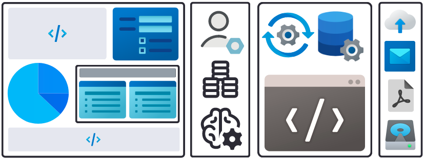

# Introduction to Cliosight

Cliosight is a low-code platform that allows users to quickly add SQL databases through an intuitive interface. It enables the development of versatile data apps in a matter of minutes. As we continue to evolve, we plan to expand our compatibility to include a wide range of cloud databases and data management systems.

## Free Tier (Tentative) <a name="freetier"></a>   
    
|Category     |Free for 14 days|
|:----------------------|:-------------|
|Users    | 1    |
|Datasources       | 1 (in-built)
|Data and Files    |4 GB    |
|Widgets           |Unlimited|
|Automation        |Limited|
|Notifications      |Limited |
|Customization           |None |
|Support    |Limited   |

## Support for Multiple Datasources <a name="datasources"></a>             
                  
**SQL** - MySQL, Microsoft SQL Server (and Postgres).          
**Data Warehouse** - (Google Big Query)    

## Data Privacy and Security <a name="security"></a>       
In order to provide complete assurance, Cliosight is designed to make datasets compliant with the applicable security regulations.       
   
Some of the in-built features are:    
1. Discretionary and Role-based Access Control (admin, user and admin-minor).
2. Secure protocols for data and file transfer like HTTPS and SFTP.
3. (Removal of sensitive information from data with pre-defined SQL queries.)     
   
EU and USA: [GDPR vs. HIPPA compliance](https://www.onetrust.com/blog/hipaa-vs-gdpr-compliance/)               
India: [The PDP Bill](https://www.meity.gov.in/writereaddata/files/The%20Digital%20Personal%20Data%20Potection%20Bill%2C%202022_0.pdf) &nbsp; [The EHR Standards](https://main.mohfw.gov.in/sites/default/files/17739294021483341357.pdf)         

## Admin console <a name="datasources"></a> 
Admin users have direct access to all datasource configurations, database tables, users and groups created in an account. They can run queries directly on the configured databases through our admin console. Results are displayed in the JSON format.                              

## Email Notification <a name="email"></a>    
Users will be able to send 100 emails to valid email ids during the initial 14 days trial period.

<p align="left">
<h2 align="left">Primary Components of a Cliosight Application</h2>
</p>

<b><h3>[Form](#form)  &nbsp;&nbsp;|&nbsp;&nbsp;      [Report](#report)   &nbsp;&nbsp;|&nbsp;&nbsp;     [Dashboard](#dashboard)   &nbsp;&nbsp;|&nbsp;&nbsp;    [Automation](#automation)</h3></b>                 

<p align="left">
  
</p>

## Form <a name="form"></a>    

A form in Cliosight is the standard method for populating tables. Data from a CSV file can also be imported through a form. It can have any number of nested sub-forms. With the 'pre_html' and 'post_html' JSON tags, it can appear like a static web page. A form is complete, except for the limitation that it can only have one submit button.    
      
Pre-defined values in input fields like a drop-down menu or multi-select option may contain column values of a [Report](#report). By using a report which is not public, access to a field can also be restricted by an admin user. Two or more forms can be grouped together in a [Dashboard](#dashboard).                

[Click here](json_examples/form_json_format.css) to view all JSON tags that can be used within a form definition.

### Example of Forms - A Meeting Scheduler Portal <a name="form_example"></a>        
For an application like a "company meeting scheduler" portal, forms can be used to add contacts, groups and meeting requests. Data captured can be used to [automate](#automation) tasks like sending out emails for meeting invite, update or cancellation based on some logical decisions.          

<b>[Contact](https://app.cliosight.com/app/forms/35/show/public?noNavbar=true),   [Group](https://app.cliosight.com/app/forms/34/show/public?noNavbar=true),   [Meeting](https://app.cliosight.com/app/forms/58/show/public?noNavbar=true)</b>     

Note that adding 'Groups' to a 'Contact' and a 'Meeting' are disabled. This is because the [reports](#report) listing group names defined by their respective SQL queries are not public. 

**Creating the 'Meeting' form** <a name="meeting_form"></a> ( [JSON](json_examples/meeting_form.json) )        

This example shows how a Cliosight form can accomodate complex scenarios of an application.    
    
1. Multiselect input options from a report column          
2. Drop down menu with hardcoded values     
3. Rules based on the values selected from the drop down    
4. 'Meeting Purpose' sub-form          
5. Multiple instances of aggregated values within the sub-form      

### File Storage <a name="afiles"></a>      
This platform provides specific functionalities for files uploaded through a form. For instance, validation based on size, type and resolution for images. Files are also equipped with access control, similar to UI components.     
      
## Report <a name="report"></a>          
While a Cliosight form is a unique data entry interface, a report is simply the output of a SQL query. It supports multiple statements. Data in a report can be exported to other datasources through [jobs](#jobs). Within an enterprise application's schema, there can be numerous SQL queries, leading to countless report and filter combinations. This is because a filter, like any form input field, can show the column values of another report in addition to hard-coded values.     

### Example of a Report - Contacts and Groups  <a name="report_example"></a> 
<b>[Contacts & Groups](https://app.cliosight.com/app/reports/29/show/public?noNavbar=true)</b> is the list of all contacts with associated groups.      
      
**SQL query:**         
``` sql
select min(c.id) as contact_id, min(gc.group_id) as group_id, min(c.name) as Name, \
min(c.email) as Email, min(c.phone) as Phone, min(c.stage) as Stage, \      
count(gc.id) as 'Total Groups' from `contacts` c  \     
left join `groups_contacts` gc on gc.contact_id = c.id  \
where ({{term}} is null or c.name like concat('%',{{term}},'%') or c.phone like concat('%',{{term}},'%'))  \
and (c.name = {{Name}} or {{Name}} is null)  \
and (c.phone = {{Phone}} or {{Phone}} is null)  \
group by c.id limit {{startIndex}}, {{pageSize}};
```
[Click here](json_examples/contacts_and_groups_report.json) to view the JSON definition for this report.    

### Creating Graphs and Charts <a name="graphs"></a>
Tabular data from reports can be used to plot graphs and charts using Javascript libraries like Chart.js, HighCharts, D3.js and C3.js to name a few. One such example is a line chart that depicts datasets in three different datasources, viz. in-built, containerized and fully-managed MySQL database instances across different cloud platforms. We can also display stats by fetching data from tables.      
     
Chart for different datasources                    
[Important stats](https://app.cliosight.com/app/reports/85/show/public?noNavbar=true)   

SQL query for the report:     
```sql
select concat(count(*), ' Meetings Scheduled') from `meetings` as count       
union all   
select concat(count(*), ' Contacts Created') from `contacts` as count    
union all    
select concat(count(*), ' Groups Organized') from `groups` as count    
union all    
select concat(count(*), ' Interviews Recorded') from `interviews` as count    
```
JSON:    
```json
{
    "datasource_id": "1",
    "pre_html": "",
    "is_public": {
        "status": true
    },
    "css_definition": "",
    "post_html": "",
    "columns": {}
}
```
### Exporting Report data into PDF file <a name="pdf"></a>
With the 'export_html' JSON tag, row data in a report can be exported instantly into a PDF file in a pre-defined format. This operation can be automated with triggers and jobs in a workflow to serve many business use cases. For instance, sending an invoice, medical test report or a certificate through email.         
     
### Using Reports in Jupyter Notebook <a name="jupyter"></a>
Public or private datasets are typically downloaded as files on the hard disk of a personal computer, cloud virtual machine or storage attached to a serverless application. Data is processed, split and merged accordingly. Results can be dumped as a CSV file or plotted on a graph using matplotlib, seaborn etc. Datasets can also be shared using framework libraries like TensorFlow Dataset (TFDS) and `torch.utils.data` in PyTorch.     

Alternatively, reports from different datasources in one or more Cliosight accounts can be used for the same purpose. The results of subsequent operations can be pushed back to connected datasources as new reports or as additional records for existing reports. This makes creating, updating and sharing datasets more accessible in a collaborative work environment.   

### Ensuring Trustworthiness <a name="trust"></a>           
Users can restrict data input into a table using the following methods:  
1. Disabling CSV data import.     
2. Disabling manual insert, update or delete query execution on the associated tables.
3. Ensuring that no other forms or endpoints can insert data into those restricted tables.
4. Disabling data export.       

This approach ensures that the primary table and associated sub-form tables receive their inputs through the designated form or endpoint only. This real-world data can be used for generating better artificial datasets in a machine learning application.
       
## Dashboard <a name="dashboard"></a>        
A dashboard is an aggregation of forms, reports, charts and HTML. This makes it the easiest way to create and host an analytics dashboard or a single page data application.        
    
### Example of a Dashboard <a name="dashboard_example"></a>   

<b>[Cliosight Meetings](https://app.cliosight.com/app/dashboards/49/show/public?noNavbar=true)</b> has the following UI components.                     
1. A report displaying some important numbers          
2. Forms to create contacts, groups and meetings requests
3. A report for listing all meeting documents      
4. Two reports with a global filter       
5. HTML in between UI components      
6. (Charts)           

[Click here](json_examples/cliosight_meetings_dashboard.json) to view the JSON definition for this dashboard.

## Automation <a name="automation"></a>   
Forms, reports and dashboards are useful for data visualization. However, for developing a full-fledged cloud-hosted application, automation is necessary. Our syntax provides a shorthand for one-click addition of automated tasks. Provision for adding user-defined Javascript and Python code will be available later.     

Since this is the backend of a Cliosight application, only admins will have access to this section.      

### Trigger <a name="trigger"></a>   
A trigger enables action on data. Since we are dealing primarily with structured data, it implies executing CRUD operations on a report.      

### Sending Email Notifications <a name="trigger_email"></a>        
Sending notifications on events can be configured like any other backend component.   
    
### Example of a Trigger - Managing an SCD (Slowly Changing Dimension) <a name="scd"></a>    
**Existing Contact update action**  
```json 
{
    "client_id": 2,
    "trigger_definition": {
        "trigger_type": "update",
        "trigger_entity": "`contacts`",
        "trigger_condition_query": "select ('{{old_row.stage}}' <> '{{new_row.stage}}') as 'condition'",
        "trigger_action_query": "insert into contacts_scd (email, stage, start_datetime) values('{{new_row.email}}', '{{new_row.stage}}', '{{current_datetime}}')",
        "label": "Existing Contact Stage SCD"
    },
    "datasource_id": 1
}
```
### Job <a name="jobs"></a>   
A job executes SQL queries at intervals for performing an ETL operation.   

### Example of a Job - Managing free tier users of a SaaS platform <a name="job_example"></a>     
Let's consider a simple application that notifies trial users of a SaaS product. Marketing admins need to send notifications everyday through email.     

### Workflow <a name="workflow"></a>     
Data analysis can provide pointers for fine-tuning a design through hypothesis testing. It can also help in improving the performance of a machine learning model in production with high-quality datasets. Every component in Cliosight can be created instantly in external applications. Being able to create a workflow by combining repetitive tasks using a simple JSON definition can speed up a project that is backed by deep insights from data.      

A workflow in Cliosight is an aggregation of jobs and triggers. Since it can be configured for only one datasource at a time, fetching data from others has to be carried out through utility jobs.       

### Example of a Workflow - Executing daily sales operational tasks <a name="workflowexamples"></a>        
Consider the sales funnel that comprises sending out personalized emails to existing and potential customers on certain events at regular intervals.   

## Examples of Cliosight API endpoints <a name="python"></a>     

### Fetching Data from a Report           
       
```python
...
url = "https://app.cliosight.com/node/reports/70/data"
# with filter
# url = "https://app.cliosight.com/node/reports/70/data?tableRow={\"Agent\":\"Best Bricks\"}"

payload = json.dumps({
  "startIndex": 0,
  "pageSize": 500  
})

response = requests.request("POST", url, headers=headers, data=payload)
...
```
### Creating a new Report           
```python
...
json_data = {
    'report_definition': {
        'config': '{ "columns": {}\n}',
        'query': "select * from `contacts` c where c.name like '%Jigisha%'",
        'label': 'Contacts Named Jigisha',
    },
    'mc_users': [
        '2',
        '6',
    ],
    'mc_groups': [
        '5',
    ],
    'datasource_id': '1',
}

response = requests.post('https://app.cliosight.com/node/reports/create', headers=headers, json=json_data)
...        
```

## Leveraging AI <a name="ai"></a>
To provide a better user experience through the use of AI, we will add code generators for the two types of syntaxes used within our platform.  
1. SQL query generator for creating reports,     
2. JSON body generator for element configuration.   

Current rapid application development |  Low-code development with Cliosight
:------------------------------------:|:--------------------------------------:
 |     


As AI adoption continues to grow across industries, leveraging advanced ML models for data processing can greatly reduce the time and effort required to get high-quality data from distributed sources. It can significantly accelerate file modification, data annotation, and other activities in consumer applications as described in our <b>[blog](https://medium.com/@cliosight)</b>.     


