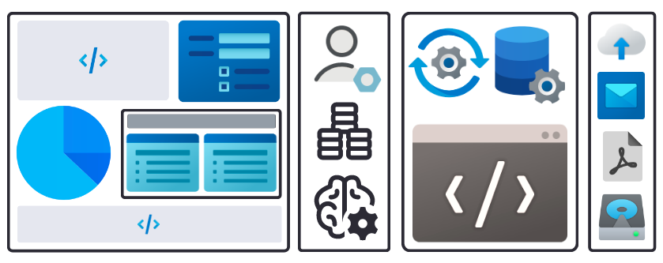

Cliosight is a low-code platform that allows users to quickly add SQL databases through an intuitive interface. It enables the development of micro CRM and data apps in a matter of minutes. This is made possible by providing a JSON syntax for configurations and SQL for creating reports. As we continue to evolve, we plan to expand our compatibility to include a wide range of cloud databases and data management systems.   

## Building Apps 

With a bottom-up approach, developers can create versatile and highly scalable applications. Each one is a collection of portable, secure and interconnected widgets that are often nested to provide detailed insights. They can also have HTML/CSS for a website-like appearance.     
     
The primary UI components are      
1. Form          
2. Report          
3. Single-page Application          
4. CRM or Data Application / Portal / Dashboard         
    
The primary back-end components are    
1. Trigger   
2. Job
3. Workflow
       
Infrastructure includes          
1. Datasources (in-built and external)      
2. Users and Groups (for role-based discretionary access control)      
3. Storage   
4. Notifications
5. AI chat bot (to help with SQL query writing and JSON configs)   

      
### Creating Workflows in external code      
Data analysts use workflows to fine-tune machine learning models. Using Cliosight's workflow, a user can streamline the process of managing multiple jobs and triggers in an application within the platform. By automating data management tasks directly in external code via API, they can collect processed data in the corresponding databases. This way the effort needed to manage high quality data in a project becomes much lesser than usual.     
         
### Ensuring Trustworthiness
It is indeed easy to designate a form for collecting data into a particular table only, in an in-built datasource. This is to ensure that the final insights derived from this data is highly reliable.   
These tables will be restricted in the sense that no other form can be used to populate these tables. Other ways are:     
1. Disabling manual access via admin console      
2. Disabling bulk CSV data import through the form  interface     
         
### Sharing Datasets    
In present times, data analysts and data scientists dump datasets as .csv files. This is written to their local or remote disks or cloud storage attached to serverless infrastructure where Jupyter is installed and accessed remotely. They can also share public and private datasets using the in-built Tensorflow or Pytorch libraries.   
Reports in Cliosight can be used for the same purpose. They can be updated in an external application's code to be written back as a new report or as additional rows in an existing report. The major advantages of this approach is that, users can share heterogeneous data with ease in a collaborative work environment with diverse technical skills. By applying role-based access control, actions on that data can be controlled by the owner.    
    
